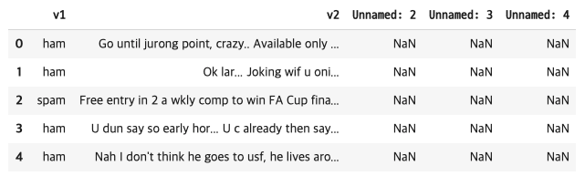
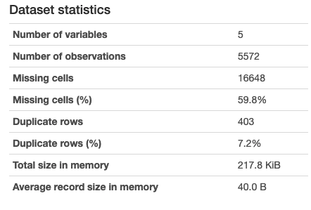

# 자연어 처리

## 정의

- 자연어 : 우리가 일상 생활에서 사용하는 언어
- 자연어 처리 : 자연어의 의미 분석 / 컴퓨터가 처리할 수 있게 돕는 것

## 예시

```python
import pandas as pd
import pandas_profiling
data = pd.read_csv('/content/sample_data/spam.csv', encoding='latin1')
data[:5]
```



```python
# ! pip install https://github.com/pandas-profiling/pandas-profiling/archive/master.zip (pandas_profiling을 google colab에 설치)
data.profile_report()
```

- 데이터에 대한 profile 보고서 생성



- 결측치의 양, 비율, 중복된 데이터 등을 분석

## 머신 러닝 워크플로우

- 수집 : 코퍼스(말뭉치 데이터) 수집
- 점검 및 탐색 : EDA. 데이터의 특징과 내재하는 구조적 관계 탐구
- 전처리 및 정제 : 토큰화 / 정제 / 정규화 / 불용어 제거
- 모델링 및 훈련 : 사용할 모델 정하고 데이터 분리(훈련용 / 검증용 / 테스트용)
- 평가 : 테스트용 데이터로 모델 평가
- 배포 : 기계가 성공적으로 훈련되었다면 완성된 모델 배포

# 텍스트 전처리

## 토큰화

- 코퍼스를 토큰으로 분리하는 작업, 토큰은 의미있는 단위라는 뜻

```tex
Time is an illusion. Lunchtime double so!
=> 'Time', 'is', 'an', 'illusion', 'Lunchtime', 'double', 'so'
```

- 모든 구두점 제거가 토큰화를 의미하지 않음 -> 오히려 모든 걸 제거하면 토큰의 의미를 잃어버림
- 영어는 띄어쓰기로 자르면 단어 토큰이 구분됨
- 한국어는 띄어쓰기만으로는 단어 토큰을 구분할 수 없음

### 토큰화 유의점

"**Don't be fooled by the dark sounding name, Mr. Jone's Orphanage is as cheery as cheery goes for a pastry shop.**"

의 경우 Don't 와 Jone's를 구분하는 법은 매우 다양하다.

NLTK의 경우

```python
from nltk.tokenize import word_tokenize  
print(word_tokenize("Don't be fooled by the dark sounding name, Mr. Jone's Orphanage is as cheery as cheery goes for a pastry shop."))  

##['Do', "n't", 'be', 'fooled', 'by', 'the', 'dark', 'sounding', 'name', ',', 'Mr.', 'Jone', "'s", 'Orphanage', 'is', 'as', 'cheery', 'as', 'cheery', 'goes', 'for', 'a', 'pastry', 'shop', '.'] 
```

wordPunctTokenizer의 경우

```python
from nltk.tokenize import WordPunctTokenizer  
print(WordPunctTokenizer().tokenize("Don't be fooled by the dark sounding name, Mr. Jone's Orphanage is as cheery as cheery goes for a pastry shop."))

##['Don', "'", 't', 'be', 'fooled', 'by', 'the', 'dark', 'sounding', 'name', ',', 'Mr', '.', 'Jone', "'", 's', 'Orphanage', 'is', 'as', 'cheery', 'as', 'cheery', 'goes', 'for', 'a', 'pastry', 'shop', '.']  
```

Keras의 text_to_word_sequence의 경우

```python
from tensorflow.keras.preprocessing.text import text_to_word_sequence
print(text_to_word_sequence("Don't be fooled by the dark sounding name, Mr. Jone's Orphanage is as cheery as cheery goes for a pastry shop."))
## ["don't", 'be', 'fooled', 'by', 'the', 'dark', 'sounding', 'name', 'mr', "jone's", 'orphanage', 'is', 'as', 'cheery', 'as', 'cheery', 'goes', 'for', 'a', 'pastry', 'shop']
```

<b>토큰화 진행 시 고려사항</b>

- 구두점/특수문자 단순 제외 금지
- 줄임말과 단어 내에 띄어쓰기가 있는 경우
- 표준 토큰화 예제

### 문장 토큰화

- 무조건 마침표만 가지고 문장을 구분할 수 없음
  - Ex.  **IP 192.168.56.31 서버에 들어가서 로그 파일 저장해서 ukairia777@gmail.com로 결과 좀 보내줘. 그러고나서 점심 먹으러 가자.**
- 한국어의 경우 kss를 추천

```python
import kss

text='딥 러닝 자연어 처리가 재미있기는 합니다. 그런데 문제는 영어보다 한국어로 할 때 너무 어려워요. 농담아니에요. 이제 해보면 알걸요?'
print(kss.split_sentences(text))
```

### 한국어 토큰화 실습

```python
!pip install konlpy
from konlpy.tag import Okt  
okt=Okt()  
print(okt.morphs("열심히 코딩한 당신, 연휴에는 여행을 가봐요"))
#['열심히', '코딩', '한', '당신', ',', '연휴', '에는', '여행', '을', '가봐요']
print(okt.pos("열심히 코딩한 당신, 연휴에는 여행을 가봐요"))
#[('열심히', 'Adverb'), ('코딩', 'Noun'), ('한', 'Josa'), ('당신', 'Noun'), (',', 'Punctuation'), ('연휴', 'Noun'), ('에는', 'Josa'), ('여행', 'Noun'), ('을', 'Josa'), ('가봐요', 'Verb')]
print(okt.nouns("열심히 코딩한 당신, 연휴에는 여행을 가봐요"))
#['코딩', '당신', '연휴', '여행']
```

- 한국의 형태소 분석기
  - mecab : 속도 중시, 분석 품질도 상위권
  - KOMORAN : 자소 분리나 오탈자에 대해서 품질 보증 필요

-----

## 정제 & 정규화

- 정제 : 코퍼스로부터 노이즈 데이터 제거
- 정규화 : 표현 방법이 다른 단어를 통합시켜 같은 단어로 생성
- 기법들
  - 규칙에 기반한 표기가 다른 단어들의 통합 (ex. USA-US)
  - 대, 소문자 통합
  - 불필요한 단어 제거
  - 정규 표현식

## 어간 추출(Stemming)과 표제어(Lemmatization)

### 표제어

- 어간 : 단어의 의미를 담고 있는 핵심 부분
- 접사 : 단어에 추가적인 의미를 주는 부분

### 어간 추출

- 어간을 추출하는 작업
- 알고리즘을 쓸 때에는 어떤 스태머가 해당 코퍼스에 적합한지를 판단한 후 사용해야 함
  - 단순 규칙에 의해서 글자들을 추출하므로 사전에 없는 글자들을 Stemming하게 됨

## 불용어

- 자주 등장하지만 큰 의미가 없는 단어들을 지우는 작업이 필요
- 보편적인 한국어 불용어 리스트가 있긴 하나, txt / csv파일로 불용어들을 정리하고 이를 불러와서 사용할 수도 있음.

## 정수 인코딩

- 자주 쓰이는 단어들에 적은 인덱스를 부여하여 어느 단어가 가장 많이 쓰였는지를 알 수 있다.

```python
from tensorflow.keras.preprocessing.text import Tokenizer

sentences=[['barber', 'person'], ['barber', 'good', 'person'], ['barber', 'huge', 'person'], ['knew', 'secret'], ['secret', 'kept', 'huge', 'secret'], ['huge', 'secret'], ['barber', 'kept', 'word'], ['barber', 'kept', 'word'], ['barber', 'kept', 'secret'], ['keeping', 'keeping', 'huge', 'secret', 'driving', 'barber', 'crazy'], ['barber', 'went', 'huge', 'mountain']]
tokenizer = Tokenizer()
tokenizer.fit_on_texts(sentences)
print(tokenizer.word_index)
print(tokenizer.word_counts)
print(tokenizer.texts_to_sequences(sentences))
vocab_size = 5
tokenizer = Tokenizer(num_words = vocab_size + 1) # 상위 5개 단어만 사용
tokenizer.fit_on_texts(sentences)
print(tokenizer.word_index)
print(tokenizer.word_counts)
print(tokenizer.texts_to_sequences(sentences))
```

## 패딩

- 길이가 전부 동일한 문서들에 대해서는 하나의 행렬로 보고, 한꺼번에 묶어서 처리할 수 있습니다. 
- 여러 문장의 길이를 임의로 동일하게 맞춰주는 작업이 필요할 때가 있습니다. 

```python
from tensorflow.keras.preprocessing.sequence import pad_sequences
encoded = tokenizer.texts_to_sequences(sentences)
print(encoded)
## [[1, 5], [1, 5], [1, 3, 5], [2], [2, 4, 3, 2], [3, 2], [1, 4], [1, 4], [1, 4, 2], [3, 2, 1], [1, 3]]
padded = pad_sequences(encoded)
padded
print(padded)
#array([[0, 0, 1, 5],
#       [0, 0, 1, 5],
#       [0, 1, 3, 5],
#       [0, 0, 0, 2],
#       [2, 4, 3, 2],
#       [0, 0, 3, 2],
#       [0, 0, 1, 4],
#       [0, 0, 1, 4],
#       [0, 1, 4, 2],
#       [0, 3, 2, 1],
#       [0, 0, 1, 3]], dtype=int32)
```

## one-hot encoding

- 이러한 표현 방식은 단어의 개수가 늘어날 수록, 벡터를 저장하기 위해 필요한 공간이 계속 늘어난다는 단점이 있다.
- 단어의 유사도를 표현하지 못한다는 단점
- 이러한 단점을 해결하기 위해 단어의 잠재 의미를 반영하여 다차원 공간에 벡터화 하는 기법으로 크게 두 가지가 있습니다. 
  - 첫째는 카운트 기반의 벡터화 방법인 LSA, HAL 등이 있으며, 
  - 둘째는 예측 기반으로 벡터화하는 NNLM, RNNLM, Word2Vec, FastText 등이 있습니다. 
  - 그리고 카운트 기반과 예측 기반 두 가지 방법을 모두 사용하는 방법으로 GloVe라는 방법이 존재합니다.

------

## 한국어 전처리 패키지

### PykoSpacing

- 띄어쓰기가 돠어있지 않은 문장을 띄어쓰기를 한 문장으로 변환

### Py-Hanspell

- 네이버 한글 맞춤법 검사기를 바탕으로 만들어진 패키지

### SOYNLP

- 단어 토큰화에 사용
- 비지도학습
- 채팅 등의 불필요하게 자주 쓰이는 ㅋㅋㅋ, ㅠㅠㅠ 등을 정제해 줌

--------

# 언어 모델

- 정의 : 단어 시퀀스에 확률 할당
- 이전 단어들이 주어졌을 때 다음 단어를 예측

## 통계적 언어 모델

- 충분한 데이터를 관측하지 못해 언어를 제대로 모델링하지 못하는 문제(희소 문제)에 봉착

## N-gram 언어 모델

- 모든 단어가 아닌 일부 단어만을 고려
- n의 의미 : 일부 단어 중 몇 개만 볼거냐(k-nearest neighbor와 유사)
- n개의 단어 뭉치 단위로 끊어서 부분들을 하나의 토큰으로 간주(n<=4)
- 뒤의 단어 몇 개만 보다 보니 의도하고 싶은 대로 문장을 끝맺음하지 못함
- 정확도를 위해 n은 5를 넘어서는 안됨
- 예측하고자 하는 언어 모델의 코퍼스를 해당 도메인의 코퍼스로 쓴다면 예측 확률이 높아짐(전문 분야의 경우)

## 한국어가 언어 모델에서 어려운 이유

1. 한국어는 어순이 중요하지 않다.
2. 한국어는 교착어이다.
   1. 한국어에는 조사가 있다. 이를 제거하기 위해 토큰화를 통해 조사/접사를 제거해야 한다.
3. 한국어는 띄어쓰기가 제대로 지켜지지 않는다.

## 펄플렉서티(Perplexity-PPL)

- 언어 모델을 평가하기 위한 내부 지표
- 헷갈리는 정도, 그러므로 낮을수록 좋다.

# 카운트 기반의 단어 표현

### 단어의 표현 방법

- 국소 표현 : 해당 단어 하나만 보고 특정 값을 매핑하여 단어 표현
- 분산 표현 : 단어를 표현하고자 주변을 참고

## Bag of Words

- 단어의 출현 빈도에만 집중하는 텍스트 데이터의 수치화 표현 방법
- CountVectorizer 클래스로 BoW를 만들 수 있음
- 불용어를 제거한 BoW 제작 가능

## TF-IDF

- 문서 단어 행렬(DTM)안에 있는 각 단어에 대한 중요도를 계산할 수 있음
- 항상 DTM보다 뛰어나진 않음
- 주로 문서의 유사도를 구하는 작업, 검색 결과의 중요도를 정하는 작업, 문서 내에서 특정 단어의 중요도를 구하는 작업 등에 활용

# 문서 유사도

## 코사인 유사도

- 두 벡터 간의 코사인 각도를 통해 유사도 측정(-1<=x<=1)
- 문서의 길이가 다른 상황에서 비교적 공정한 비교 가능
  - 벡터의 크기보다는 방향에 초점

```python
import pandas as pd
from sklearn.feature_extraction.text import TfidfVectorizer
from sklearn.metrics.pairwise import linear_kernel

data = pd.read_csv('/content/sample_data/movies_metadata.csv', low_memory=False)
data = data.head(20000)

data['overview'] = data['overview'].fillna('')
tfidf = TfidfVectorizer(stop_words='english')
# overview에 대해서 tf-idf 수행
tfidf_matrix = tfidf.fit_transform(data['overview'])
print(tfidf_matrix.shape)

indices = pd.Series(data.index, index=data['title']).drop_duplicates()
print(indices.head())

idx = indices['Father of the Bride Part II']
print(idx)
cosine_sim = linear_kernel(tfidf_matrix, tfidf_matrix)

def get_recommendations(title, cosine_sim=cosine_sim):
    # 선택한 영화의 타이틀로부터 해당되는 인덱스를 받아옵니다. 이제 선택한 영화를 가지고 연산할 수 있습니다.
    idx = indices[title]

    # 모든 영화에 대해서 해당 영화와의 유사도를 구합니다.
    sim_scores = list(enumerate(cosine_sim[idx]))

    # 유사도에 따라 영화들을 정렬합니다.
    sim_scores = sorted(sim_scores, key=lambda x: x[1], reverse=True)

    # 가장 유사한 10개의 영화를 받아옵니다.
    sim_scores = sim_scores[1:11]

    # 가장 유사한 10개의 영화의 인덱스를 받아옵니다.
    movie_indices = [i[0] for i in sim_scores]

    # 가장 유사한 10개의 영화의 제목을 리턴합니다.
    return data['title'].iloc[movie_indices]

get_recommendations('The Dark Knight Rises')


#12481                            The Dark Knight
#150                               Batman Forever
#1328                              Batman Returns
#15511                 Batman: Under the Red Hood
#585                                       Batman
#9230          Batman Beyond: Return of the Joker
#18035                           Batman: Year One
#19792    Batman: The Dark Knight Returns, Part 1
#3095                Batman: Mask of the Phantasm
#10122                              Batman Begins
#Name: title, dtype: object
```


# 토픽 모델링

- 토픽이라는 문서 집합의 추상적인 주제를 발견하기 위한 통계적 모델
- 텍스트 본문의 숨겨진 의미 구조 파악을 위한 텍스트 마이닝 기법

## 잠재 의미 분석(LSA)

- 문서 단어 행렬(DTM)의 잠재된(Latent) 의미를 이끌어내는 방법
- 기본적으로 DTM이나 TF-IDF 행렬에 절단된 SVD(truncated SVD)를 사용하여 차원을 축소시키고, 단어들의 잠재적인 의미를 끌어낸다

## 잠재 디레클레 할당(LDA)

- 문서들은 토픽들의 혼합으로 구성되어져 있으며, 토픽들은 확률 분포에 기반하여 단어들을 생성한다고 가정
- LDA는 단어의 순서는 신경쓰지 않겠다
- 수행 과정
  - **1) 사용자는 알고리즘에게 토픽의 개수 k를 알려줍니다.**
  - **2) 모든 단어를 k개 중 하나의 토픽에 할당합니다.**
  - **3) 이제 모든 문서의 모든 단어에 대해서 아래의 사항을 반복 진행합니다. (iterative)**
    - **3-1) 어떤 문서의 각 단어 w는 자신은 잘못된 토픽에 할당되어져 있지만, 다른 단어들은 전부 올바른 토픽에 할당되어져 있는 상태라고 가정합니다. 이에 따라 단어 w는 아래의 두 가지 기준에 따라서 토픽이 재할당됩니다.**
- LSA vs LDA
  - LSA : DTM을 차원 축소 하여 축소 차원에서 근접 단어들을 토픽으로 묶는다.
  - LDA : 단어가 특정 토픽에 존재할 확률과 문서에 특정 토픽이 존재할 확률을 결합확률로 추정하여 토픽을 추출한다.